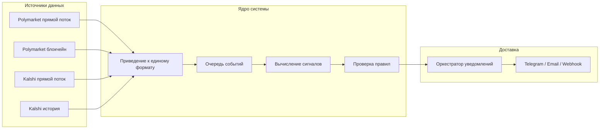
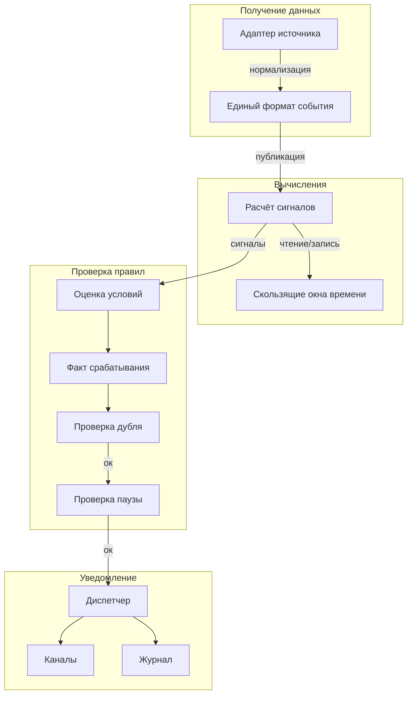
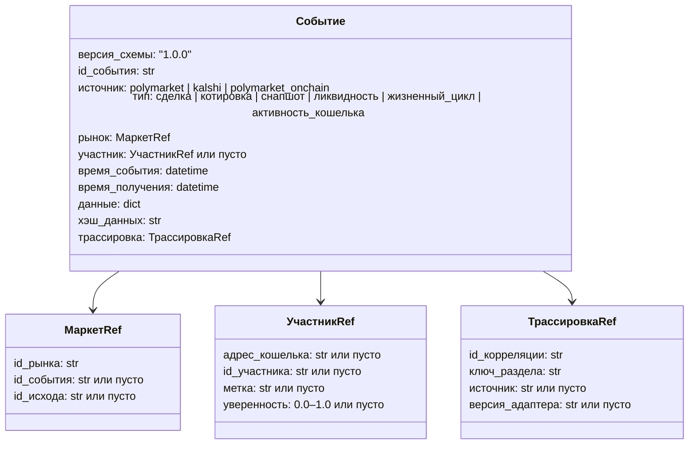
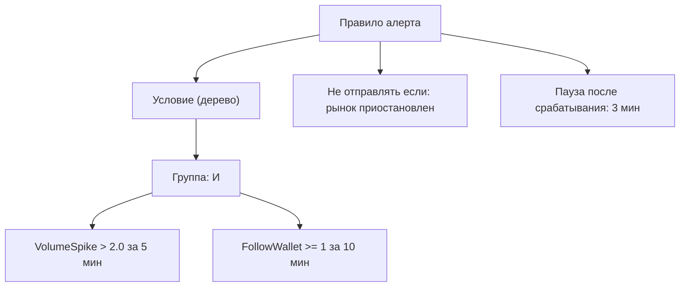
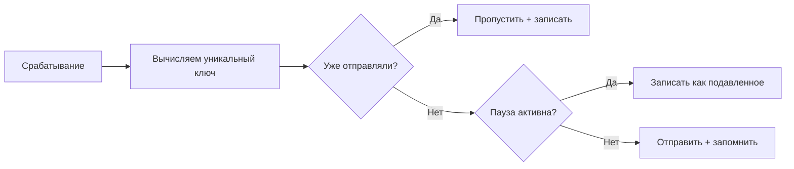
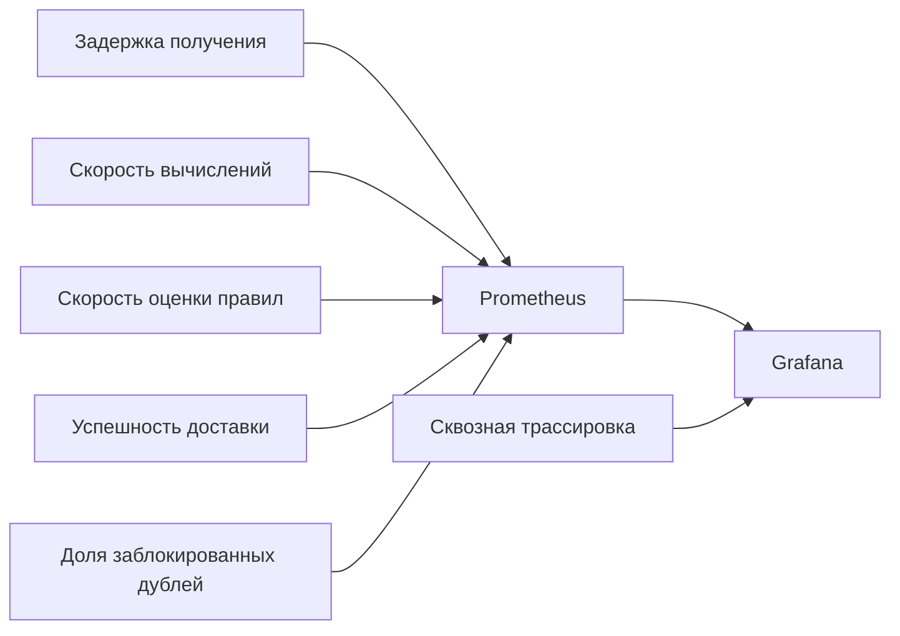
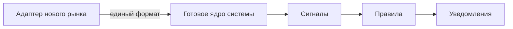

# Система умных уведомлений для рынков предсказаний

**Настраиваемые алерты под каждого пользователя**

Polymarket | Kalshi | легко расширяется

---

## В чём проблема

- Рынки предсказаний меняются **тысячи раз в минуту**
- Пропустить нужный момент — значит потерять ставку
- Следить за всем вручную невозможно
- Готовые инструменты не умеют делать **сложные персональные условия**

**Что мы делаем:**
Система, в которой каждый трейдер сам задаёт правила —
и получает уведомление в нужный момент

---

## На каких принципах строится система

| Принцип | Простыми словами |
|---|---|
| Блокчейн как источник | Где можно — берём данные прямо из сети, без посредников |
| Единый формат данных | Все рынки говорят на одном языке внутри системы |
| Понятные объяснения | Каждое уведомление объясняет, почему оно сработало |
| Защита от дублей | Одно событие — одно уведомление, не больше |
| Гибкое расширение | Новый рынок подключается без переписывания системы |

---

## Как устроена система



---

## Путь события от рынка до уведомления



---

## Единый формат событий внутри системы



---

## Зачем единый формат?

Каждый рынок «говорит по-своему»:

- Polymarket: `asset_id`, `condition_id`, `token_id`
- Kalshi: `market_ticker`, `event_ticker`
- Блокчейн: адреса контрактов, `position_id`

**Без единого формата** — каждый новый рынок требует переписывать всю логику.

**С единым форматом** — подключаешь новый рынок, а сигналы и правила уже работают.

При изменении формата используется плавная миграция: старая и новая версия работают параллельно, пока все компоненты не перейдут.

---

## Какие сигналы система умеет отслеживать

### Первая версия (MVP)

| Сигнал | Что это | Откуда данные |
|---|---|---|
| **VolumeSpike** | Резкий рост объёма торгов за 5–15 минут | Прямой поток |
| **ProbabilityJump** | Быстрое изменение вероятности исхода | Прямой поток |
| **LargeTrade** | Крупная сделка выше заданного порога | Поток / блокчейн |
| **FollowWallet** | Активность выбранного кошелька / «кита» | Блокчейн / API |
| **EventMomentum** | Единодушное движение по целой теме событий | API + поток |

### Следующие версии

- Расхождение между связанными рынками
- Серийное поведение китов
- Дисбаланс в стакане заявок

---

## Как пользователь задаёт правило



Условия комбинируются через **И / ИЛИ / НЕ**.
Для каждого сигнала задаётся порог, временное окно и чувствительность.

---

## Почему сработало — система всегда объясняет

Каждое уведомление содержит полное объяснение:

```
Правило:       «Кит + объёмный всплеск», версия 3
Время оценки:  2026-04-08 14:32:11

Условия:
  — VolumeSpike:  наблюдалось 2.43, порог 2.0, окно 5 мин  -> ВЫПОЛНЕНО
  — FollowWallet: наблюдалось 1,    порог 1,   окно 10 мин -> ВЫПОЛНЕНО

Итог: "Объём вырос в 2.43× (порог 2×) И кит активен в 10-минутном окне"
```

Пользователь видит **конкретные числа**,
а не просто "что-то произошло".

---

## Защита от лишнего шума



**Уникальный ключ** = комбинация пользователя, правила, версии, рынка и временного окна

- Одно событие → одно уведомление, без повторов
- После отправки — обязательная пауза перед следующим
- Критические алерты могут обойти паузу

---

## Надёжность системы

| Механизм | Зачем нужен |
|---|---|
| Защита от дублей | Соединение с биржей может разрываться и восстанавливаться — система всё равно не пришлёт одно событие дважды |
| Умная пауза при сбоях | Если источник недоступен — система ждёт, не зависает в бесконечных попытках |
| Карантин для сломанных данных | Некорректное событие не блокирует обработку остальных |
| Изоляция источников | Проблема с одним рынком не влияет на другие |
| Запоминание позиции | После перезапуска система продолжает с того места, где остановилась |

**Цель:** 95% уведомлений — в течение 5 секунд после события

---

## Мониторинг и диагностика



Любое уведомление можно отследить от исходного события до момента отправки.
Ни одно срабатывание не теряется бесследно.

---

## Как подключить новый рынок



Четыре шага:

1. Написать адаптер для нового источника (поток / API / блокчейн)
2. Привести данные к единому формату
3. Настроить запоминание позиции (чтобы не пропустить события после перезапуска)
4. Задокументировать особенности источника

**Всё остальное уже работает.**

---

## План первой версии — 6 недель

| Неделя | Что делаем |
|---|---|
| 1 | Фиксируем единый формат данных, заготовки адаптеров, базовая инфраструктура |
| 2 | Подключаем Polymarket и Kalshi в реальном времени |
| 3 | Реализуем первые три сигнала: объём, вероятность, крупная сделка |
| 4 | Система правил, объяснения срабатываний, защита от дублей + кит-сигналы |
| 5 | Доставка уведомлений: Telegram, email, webhook |
| 6 | Историческая загрузка Kalshi, нагрузочные тесты, финальная настройка |

---

## Риски и как мы их закрываем

| Риск | Как защищаемся |
|---|---|
| Биржа изменила API | Адаптер изолирован — меняем только его, ядро не трогаем |
| Слишком много лишних уведомлений | Настраиваемые пороги, фильтры, пауза между алертами |
| Одно событие приходит дважды | Уникальный ключ блокирует повтор |
| База данных разрастается | Автоматическое удаление старых данных, уменьшение точности архива |
| Биржа ограничивает запросы | Умное замедление запросов, очередь с приоритетом |

---

## Технологический стек

| Слой | Технология |
|---|---|
| API и управление | FastAPI |
| Модели данных | Pydantic + SQLAlchemy |
| База данных | PostgreSQL |
| Быстрый кэш и состояние | Redis |
| Очередь событий | Kafka |
| Фоновые задачи | Celery |
| Контейнеризация | Docker |
| Мониторинг | Prometheus + Grafana + OpenTelemetry |

---

## Итого

- Трейдер задаёт **любые правила** и получает уведомления в нужный момент
- Каждый алерт **объясняет**, почему сработал — конкретные числа, не просто «событие»
- Система **не спамит** — умная защита от повторов и лишнего шума
- Добавить новый рынок можно **не переписывая** всю систему
- Любой алерт **прослеживается** от исходного события до уведомления
- Первая версия — за **6 недель**
