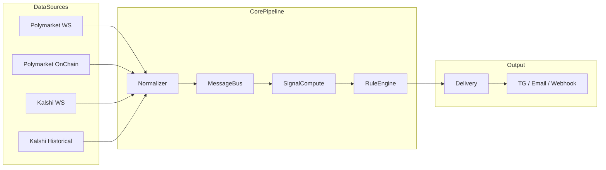
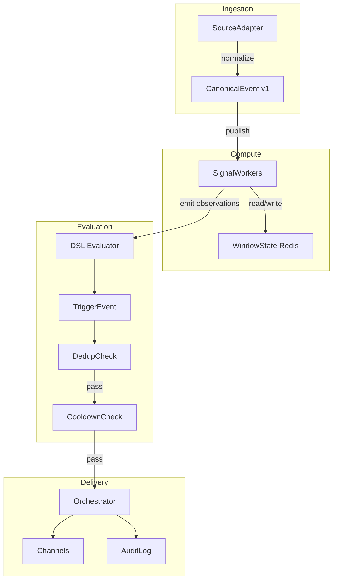
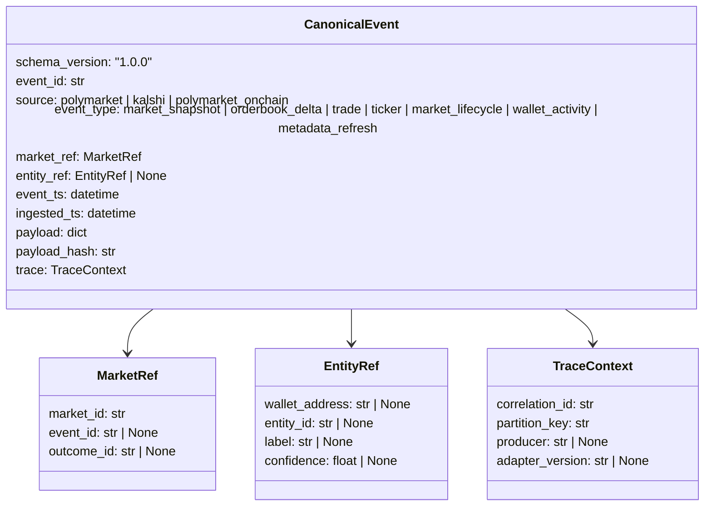
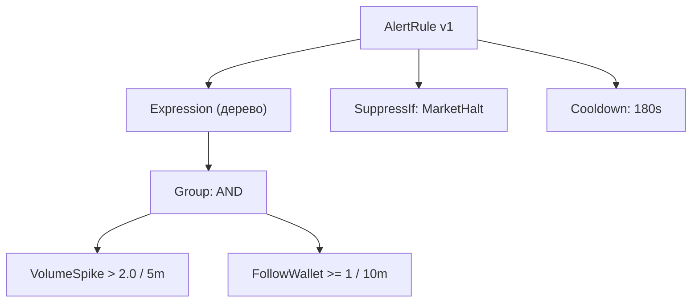
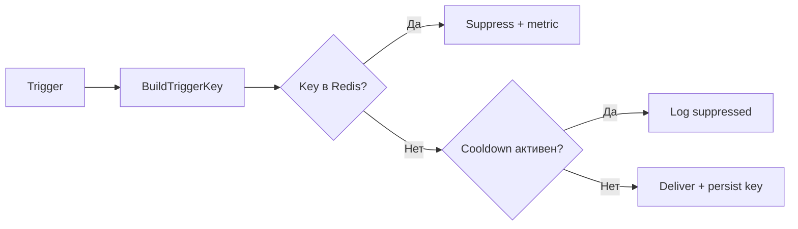
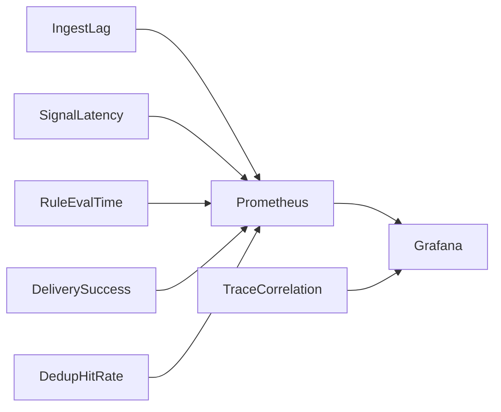
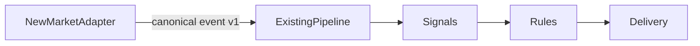

# Prediction Alerts System

**Кастомные алерты для prediction markets**

Polymarket | Kalshi | Extensible

---

## Проблема

- Рынки предсказаний генерируют тысячи событий в минуту
- Трейдеру нужно **быстро** реагировать на значимые изменения
- Ручной мониторинг невозможен: объемы, киты, корреляции
- Существующие инструменты не дают **сложных составных** алертов

**Цель:** система, где пользователь собирает кастомные правила
и получает actionable-уведомления за секунды

---

## Принципы

| Принцип | Что это значит |
|---|---|
| On-chain first | Где есть блокчейн-данные — берем оттуда |
| Canonical contract | Единый формат событий для всех источников |
| Explainability | Каждый алерт объясняет, почему сработал |
| No duplicates | Детерминированный dedup + cooldown |
| Extensibility | Новый рынок = новый адаптер, ядро не меняется |

---

## Целевая архитектура



---

## Поток данных (детально)



---

## Canonical Event — единый контракт



---

## Зачем canonical schema?

- Polymarket отдает `asset_id`, `condition_id`, `token_id`
- Kalshi отдает `market_ticker`, `event_ticker`
- On-chain — адреса контрактов и `position_id`

**Без нормализации** каждый сигнал нужно писать 3 раза.

**С canonical schema** сигналы и правила работают одинаково,
независимо от источника данных.

Версионирование: MAJOR / MINOR / PATCH + dual-write при миграции.

---

## Каталог сигналов

### MVP

| Сигнал | Что ловит | Источник |
|---|---|---|
| **VolumeSpike** | Аномальный рост объема за 5m/15m | WS ticker/trade |
| **ProbabilityJump** | Резкий сдвиг implied probability | WS price/ticker |
| **LargeTrade** | Сделка выше порога | WS trade / on-chain |
| **FollowWallet** | Активность выбранного адреса | On-chain / API |
| **EventMomentum** | Согласованное движение по теме | Gamma + WS |

### V2+

- Cross-market divergence
- Whale sequence patterns
- Liquidity / orderbook imbalance

---

## Rules DSL — как пользователь задает алерт



Пользователь комбинирует условия через `AND / OR / NOT`,
задает пороги, окна и чувствительность.

Операторы: `gt`, `gte`, `lt`, `lte`, `eq`, `ne`, `delta`, `percentile`, `zscore`

---

## Explainability — почему сработало

Каждый trigger содержит `reason_json`:

```
rule_id:        r_volume_whale_01
rule_version:   3
evaluated_at:   2026-04-08T14:32:11Z

predicates:
  - VolumeSpike:  observed=2.43, threshold=2.0, window=5m  -> PASS
  - FollowWallet: observed=1,    threshold=1,   window=10m -> PASS

summary: "VolumeSpike(2.43>2.00, 5m) AND FollowWallet(1>=1, 10m)"
```

Пользователь видит **конкретные числа и условия**,
а не просто "alert fired".

---

## Dedup и Cooldown — защита от шума



**Trigger key** = `hash(tenant, rule, version, scope, time_bucket)`

- Один и тот же сигнал в одном временном окне не дублируется
- После доставки — cooldown блокирует повторы
- Severity escalation может пробить cooldown

---

## Надежность

| Механизм | Зачем |
|---|---|
| At-least-once + idempotency | WS reconnect гарантирует дубли — система их гасит |
| Retry + exponential backoff | Внешний API упал — не бомбим, ждем |
| Dead Letter Queue | Ядовитые события не блокируют pipeline |
| Circuit breaker per source | Один источник не роняет остальные |
| Checkpointing | После рестарта продолжаем с последней позиции |

**SLO:** 95% алертов доставляются <= 5 секунд (realtime sources)

---

## Наблюдаемость



Сквозная трассировка: `canonical_event_id` -> `trigger_id` -> `delivery_id`

Любой алерт можно проследить от сырого события до уведомления.

---

## Расширяемость — новый рынок



Чтобы подключить новый рынок:

1. Написать адаптер (WS / REST / on-chain)
2. Маппить в canonical schema v1
3. Добавить checkpointing
4. Обновить `verified-facts.md`

**Ядро системы не меняется.**

---

## MVP — 6 недель

| Неделя | Что делаем |
|---|---|
| 1 | Schema v1, скелеты адаптеров, checkpoint-таблицы |
| 2 | Polymarket WS + Gamma, Kalshi WS маппинг |
| 3 | Сигналы: VolumeSpike, ProbabilityJump, LargeTrade |
| 4 | Rule engine v1, DSL, dedup + FollowWallet, EventMomentum |
| 5 | Delivery: webhook / Telegram / email, cooldown |
| 6 | Backfill (Kalshi historical), нагрузочные тесты, SLO |

---

## Риски и защита

| Риск | Mitigation |
|---|---|
| API рынка изменился | Адаптер изолирован, contract tests |
| Шум и false positives | Baseline нормализация, user sensitivity presets |
| Дубликаты при reconnect | Deterministic trigger key + time-bucket |
| Рост хранилища | Retention tiers + downsampling |
| Kalshi rate limit | Adaptive backoff + per-source budget |

---

## Стек

| Слой | Технология |
|---|---|
| API | FastAPI |
| Модели | Pydantic + SQLAlchemy |
| БД | PostgreSQL |
| Кеш / State | Redis |
| Очереди | Kafka |
| Воркеры | Celery |
| Контейнеры | Docker |
| Мониторинг | Prometheus + Grafana + OpenTelemetry |

---

## Итого

- Пользователь создает **сложные составные алерты** за минуту
- Система объясняет **почему** сработало
- Не спамит дублями — **dedup + cooldown**
- Новый рынок подключается **без изменения ядра**
- Полная трассировка от события до уведомления
- MVP за **6 недель**
