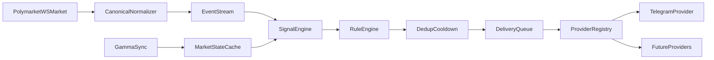
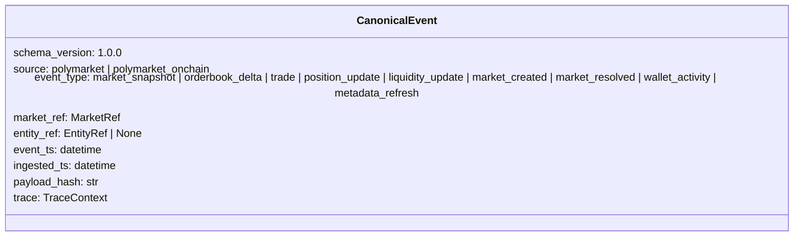
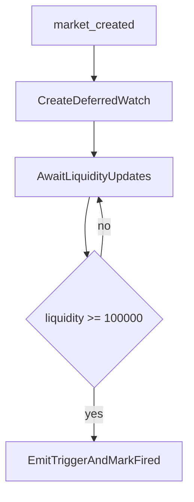

# Polymarket Alerts MVP

Custom alerts with explainability, provider-abstracted delivery, and low-latency triggering.

---

## Product Scope

- Platform: Polymarket only
- Delivery model: channel abstraction (`DeliveryProvider`), Telegram provider enabled in MVP
- SLA target: p95 `source_event_ts -> delivery_enqueue_ts <= 1s`
- Example alert presets:
  - A: trader position updates with trader quality filters
  - B: 5-minute volume spikes on Iran-tagged markets
  - C: new markets with deferred liquidity threshold crossing
- Presets are onboarding templates; rule engine remains fully customizable.

---

## End-to-End Flow

---

## Canonical Event Contract

---

## Rule Evaluation Strategy

1. Pre-filter alerts by `rule_type`, category tags, and event type.
2. Read in-memory/Redis indexes of active alerts.
3. Evaluate expression tree (`AND/OR/NOT`, compare operators).
4. Build explainability payload (`reason_json`).
5. Apply dedup and cooldown.
6. Enqueue provider-agnostic delivery payload.

---

## What User Configures

- Authoring mode: preset template or fully custom rule
- Signals/conditions: thresholds, operators, windows
- Scope: tags/categories, trader filters, market scope
- Noise controls: cooldown and suppression
- Delivery: one or many channels + destinations
- Optional delayed trigger: arm now, fire on crossing later

---

## Minimal Data Metrics (MVP)

- `price_return_1m_pct` from WS `last_trade_price` / `price_change`
- `price_return_5m_pct` from WS `last_trade_price` / `price_change`
- `spread_bps` from WS `book` best bid/ask
- `book_imbalance_topN` from WS `book` depth
- `liquidity_usd` from Gamma metadata sync

Chosen for low implementation cost and strong decision value under realtime constraints.

---

## Default Profiles (Starter Values)

- Conservative: `r1m>=2.0`, `r5m>=4.0`, `spread<=80bps`, `|imbalance|>=0.30`, `liq>=250k`, `cooldown=300s`
- Balanced (default): `r1m>=1.2`, `r5m>=2.5`, `spread<=120bps`, `|imbalance|>=0.20`, `liq>=100k`, `cooldown=180s`
- Aggressive: `r1m>=0.7`, `r5m>=1.5`, `spread<=180bps`, `|imbalance|>=0.12`, `liq>=50k`, `cooldown=90s`

Users can switch profile instantly; runtime path stays identical, only thresholds differ.

---

## Example A (Trader Position Updates)

Trigger when event is one of:

- `open_position`
- `close_position`
- `increase_position`
- `decrease_position`

And filters hold:

- `smart_score > 80`
- `account_age_days > 365`
- Market includes `Politics` tag

---

## Example B (Volume Spike, 5m)

- Scope markets by Polymarket tags including Iran-related tag set
- Compute rolling 5-minute volume baseline
- Trigger when current window crosses configured spike threshold
- Cooldown per `(tenant, rule, rule_version, market_id, telegram)`

---

## Example C (Deferred Liquidity Trigger)

- Watch state is durable (Postgres), not only cache
- Single-fire semantics per `(alert_id, market_id)`
- Expiration (`ttl_hours`) prevents infinite watches

---

## MVP Entity Set

- `User`: recipient identity (channel-neutral)
- `Alert`: user rule config and delivery controls
- `ChannelBinding`: destination per channel
- `DeliveryAttempt`: audit trail per provider attempt
- `Market`: title, tags, liquidity state
- `Trader`: smart score and account age
- `Trade`: normalized trade facts
- `Event`: normalized event envelope

Reference models: `src/alarm_system/entities.py`.

---

## Observability

- `event_to_enqueue_ms` (primary SLA)
- `ingest_lag_ms`
- `rule_eval_ms`
- `dedup_hits_total`
- `deferred_watch_active_total`
- `enqueue_lag_ms` and per-provider send metrics

Trace correlation is mandatory from canonical event to delivery attempt.

---

## Delivery Plan

1. Implement Polymarket WS + Gamma sync.
2. Implement state stores (Postgres + Redis).
3. Implement scenario-specific signal and rule paths.
4. Implement Telegram delivery worker with retries.
5. Load test and tune for p95 <= 1s enqueue latency.
