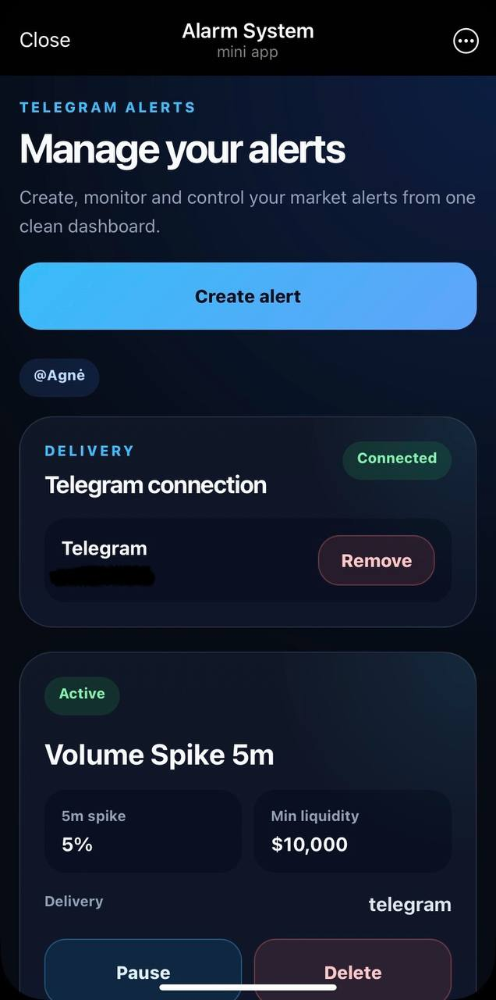
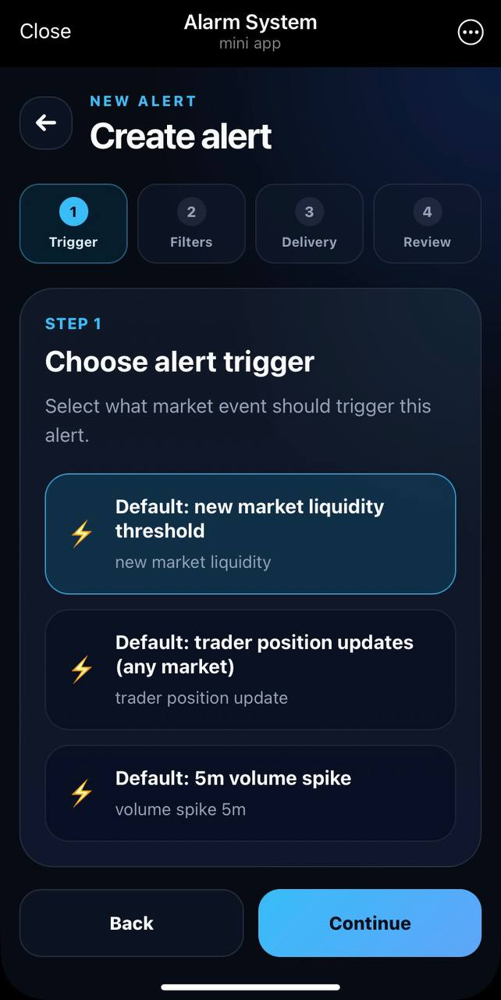
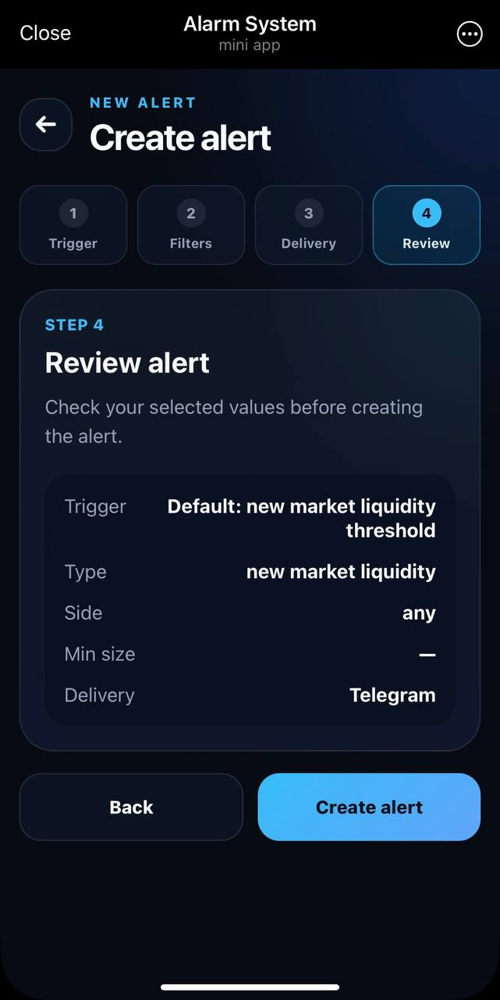
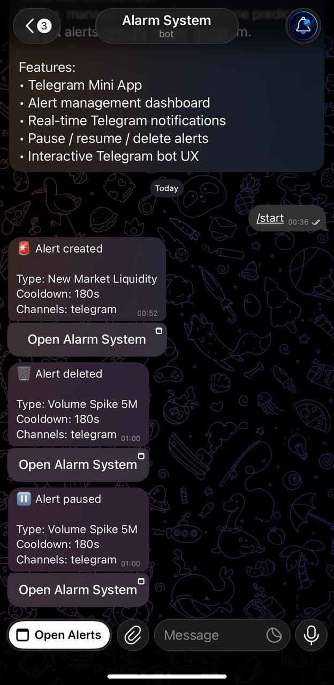

# Alarm System Frontend

Telegram Mini App for managing prediction market alerts and receiving real-time Telegram notifications.

---

## Overview

Alarm System is a full-stack Telegram-based alert platform for prediction markets.

This frontend allows users to open the app directly inside Telegram, automatically connect their Telegram account, create custom alerts, manage alert status, and receive Telegram notifications when alerts are created, paused, resumed or deleted.

The project was built as a production-style Telegram Mini App using React, TypeScript, FastAPI, Railway, Vercel and the Telegram Bot API.

---

## Features

- Telegram Mini App integration
- Telegram user detection through Telegram WebApp data
- Automatic Telegram channel binding
- User-scoped alerts dashboard
- Multi-step create alert wizard
- Pause, resume and delete alerts
- Telegram lifecycle notifications
- Inline Telegram button to reopen the Mini App
- Telegram haptic feedback
- Production error monitoring with Sentry
- Mobile-first dark UI
- Reusable UI components
- Railway backend API integration
- Vercel frontend deployment

---

## Tech Stack

### Frontend

- React
- TypeScript
- Vite
- React Router
- SCSS Modules
- Telegram Mini Apps SDK
- Sentry

### Backend

- FastAPI
- Telegram Bot API
- Railway
- Redis
- PostgreSQL

---

## Screenshots

### Dashboard Overview



---

### Create Alert Flow

#### Trigger Selection



#### Review Step



---

### Telegram Notifications



---

## Environment Variables

Create `.env`:

```env
VITE_API_BASE_URL=https://your-backend-url.com
VITE_SENTRY_DSN=https://your-sentry-dsn
```

---

## Local Development

Install dependencies:

```bash
pnpm install
```

Start development server:

```bash
pnpm dev
```

---

## Production Build

```bash
pnpm build
pnpm preview
```

---

## Telegram Mini App Setup

1. Create a Telegram bot through BotFather.
2. Configure the Mini App menu button URL.
3. Add the Telegram WebApp script inside `index.html`:

```html
<script src="https://telegram.org/js/telegram-web-app.js"></script>
```

4. Deploy the frontend to Vercel.
5. Configure backend CORS to allow the frontend origin.

---

## Main User Flow

1. User opens the Mini App inside Telegram.
2. The app reads Telegram user data.
3. Telegram account is connected automatically.
4. User creates a new market alert.
5. Backend sends Telegram notifications for alert lifecycle events.
6. User can reopen the Mini App directly from Telegram notifications.

---

## Monitoring

Frontend production errors are tracked with Sentry.

### This helps debug:

- Telegram WebView issues
- Mobile browser issues
- Production runtime errors
- Deployment problems

---

## Deployment

### Frontend

- Vercel

### Backend

- Railway

### Notifications

- Telegram Bot API

---

## Project Goals

### This project was built to explore:

- Telegram Mini Apps
- Production frontend architecture
- Telegram Bot API integrations
- Full-stack deployment workflows
- Real-time notification systems
- Mobile-first UX
- Monitoring and observability

---

## Author

- Linkedin - [Agnieska Jackevic](https://www.linkedin.com/in/agnieska-jackevic/)